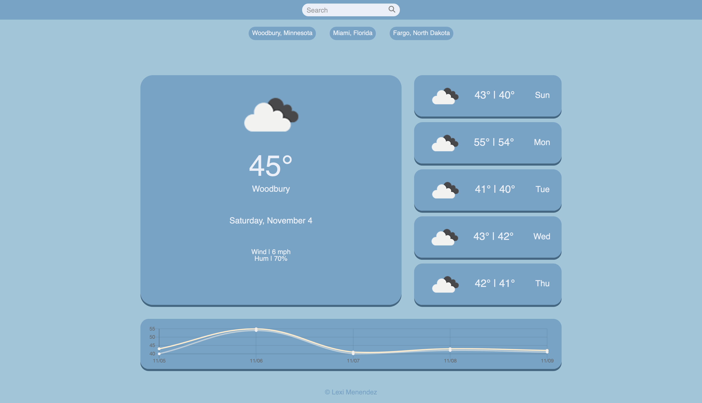

# Weather Dashboard

A website application that gives you current and future weather conditions based off the city and state the user enters. Once a city and state are entered, the user's input is saved to local storage and displayed below the search bar so that the user can return to previous searches, then the current weather conditions, future weather conditions, and a high/low temperature chart are populated. 

This website was created using the OpenWeather API database for the weather data used, as well as several Javascript frameworks including Day.js, jQuery, and Chart.js.

## Website Link

[Weather Dashboard](https://alexismenendez.github.io/amenendez-weather-dashboard/) 
[Repository](https://github.com/alexismenendez/amenendez-weather-dashboard)

## Final Product

## Frameworks & Resources
[Day.js](https://day.js.org/en/) 
[jQuery](https://jquery.com/) 
[Chart.js](https://www.chartjs.org/) 
[OpenWeather API](https://openweathermap.org/api) 
[Magnifying Glass Icon](https://fontawesome.com/icons/magnifying-glass?f=classic&s=solid)